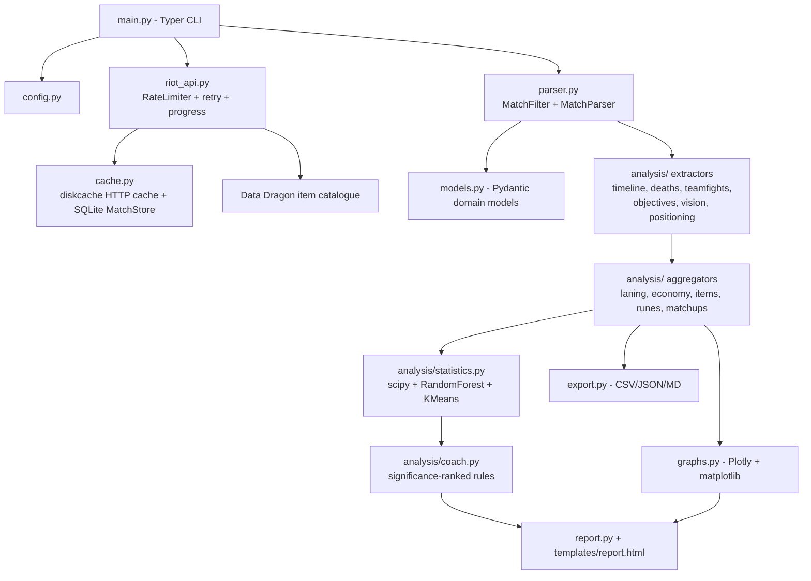

# Champion Stats Analyzer

A production-quality coaching analyzer for **any champion + lane** in ranked
solo queue, built on the Riot **Match-V5** API. Defaults to **Viktor mid**.

This is not an OP.GG clone. It doesn't just describe *what* happened — it digs
into **why you win and why you lose**: death context, objective setups, reset
habits, build timings, matchup patterns, and statistically ranked coaching
recommendations.

## Features

- Downloads up to 500 ranked solo queue matches (paged, cached, rate-limited,
  auto-retrying, with progress bars). A match is **never downloaded twice**
  (permanent SQLite store).
- Filters to **ranked solo queue · your champion · your lane · no remakes**
  (configure with `--champion` and `--lane`).
- Full timeline analysis: gold/XP/CS checkpoints and lane differentials,
  inferred recalls (with unspent gold), roams, lane priority, wave-state proxy.
- Death forensics: zone, solo/outnumbered, greed, post-tower/objective,
  pre-dragon/baron, post-recall, bounty, shutdowns, heatmaps.
- Automatic teamfight detection (spatio-temporal kill clustering) with
  participation, damage, positioning and fight outcomes.
- Objective setup analysis for dragons, barons, heralds, grubs and elders.
- Vision, item build, rune and matchup analytics with per-setup win rates.
- Advanced statistics (scipy): correlation matrix, point-biserial win
  correlations, Fisher exact win-rate splits.
- Machine learning (scikit-learn): RandomForest early-game win predictor with
  cross-validated AUC and feature importances; KMeans game clustering with
  archetype labels (throws, comebacks, stomps...).
- **AI coach**: recommendations ranked by effect size × statistical
  significance × sample size.
- **Rank peer comparison**: your stats vs curated tier averages for the same
  champion + lane (`data/benchmarks/{champion}_{role}.json`, with role fallback).
- A dark, responsive, interactive **HTML dashboard** plus CSV/JSON/Markdown
  exports.

## Setup

### 1. Get a Riot API key

1. Go to <https://developer.riotgames.com> and sign in with your Riot account.
2. Click **Regenerate API Key** on the dashboard. Development keys look like
   `RGAPI-xxxxxxxx-...` and expire every 24 hours (regenerate when needed).
3. Export it:

```bash
export RIOT_API_KEY="RGAPI-your-key-here"
```

For long-running use, apply for a **Personal API Key** on the same portal —
same rate limits, but it doesn't expire daily.

### 2. Install

Requires Python 3.12+ and [uv](https://docs.astral.sh/uv/):

```bash
cd league-champion-stats-analysis
uv sync
```

### 3. Run

```bash
# Default: Viktor mid
uv run python main.py analyze --riot-id "YourName" --tagline "EUW" --region europe

# Another champion + lane
uv run python main.py analyze --riot-id "YourName" --tagline "EUW" --champion Ahri --lane mid
uv run python main.py report --riot-id "YourName" --tagline "EUW" --champion LeeSin --lane jungle
```

`--lane` accepts aliases: `mid`, `top`, `jungle`/`jg`, `bot`/`adc`, `support`.
`--champion` accepts Riot ids (`Ahri`, `LeeSin`, `MissFortune`) or display names.

`--region` accepts regional routing values (`europe`, `americas`, `asia`, `sea`)
or platform codes (`euw1`, `na1`, `kr`, ...).

`--platform` sets the host for **league-v4** rank lookups (`euw1`, `eun1`, `na1`...).
If omitted, it is inferred from your match ids (`EUW1_...` → `euw1`). Match-v5
still uses the regional host (`europe`, etc.).

Other commands:

```bash
uv run python main.py fetch --riot-id "YourName" --tagline "EUW"   # download only
uv run python main.py report --riot-id "YourName" --tagline "EUW"  # re-analyse cached data
uv run python main.py clear-cache                                  # wipe the HTTP cache
```

You can also put defaults into a `config.toml` next to `main.py`:

```toml
riot_id = "YourName"
tagline = "EUW"
region = "europe"
match_count = 500
```

### Outputs

| File | Content |
| --- | --- |
| `output/report.html` | Interactive dark dashboard (open in any browser) |
| `output/summary.json` | Every aggregate in machine-readable form |
| `output/recommendations.md` | Ranked coaching recommendations |
| `output/matches.csv`, `deaths.csv`, `timeline.csv`, `matchups.csv`, `vision.csv`, `items.csv`, `runes.csv`, `objectives.csv`, `teamfights.csv`, `correlations.csv`, `rank_comparison.csv` | Flat tables for your own analysis |
| `output/win_predictor.joblib` | Trained RandomForest model |
| `graphs/death_heatmap.png` | Static per-phase death heatmaps |

## Architecture



Design principles:

- **Dependency injection** everywhere: the API client receives its cache and
  store, the parser its item catalogue, the coach its dataframes and
  statistics engine. `main.py` is the composition root.
- **Layered**: data (fetch/store) → parsing (raw JSON → typed models) →
  analysis (models → dataframes/summaries) → presentation (graphs/report/export).
- **Typed and documented**: every function has type hints and a docstring;
  domain objects are Pydantic models.
- **Testable**: analysis code is pure (no I/O); the test suite runs on
  synthetic Match-V5 documents without network access.

## Known API limitations (documented heuristics)

The public Match-V5 API doesn't expose everything the ideal coach would want.
Where data is missing, the analyzer uses documented proxies or reports `None`:

| Metric | Status |
| --- | --- |
| Flash/summoner cooldowns at death | **Not available** — `flash_available` is always `None` |
| "Enemy seen before death" (fog of war) | **Not available** — `enemy_seen` is always `None` |
| Enemies hit by Chaos Storm | **Not available** — `enemies_hit_by_ult` is always `None` |
| Ultimate availability at death | Proxy: R learned by then (cooldown unknown) |
| Zhonya availability at death | Proxy: Zhonya/Stopwatch in inventory (cooldown unknown) |
| Recalls & unspent gold | Inferred from purchase clusters + frame gold |
| Positions (roams, presence, grouping) | Timeline frames are 60 s apart — coarse |
| Ward positions (blind spots, vision at death) | Not exposed — counts of recent team ward events are used |
| Wave states | Proxy from the player's own position (minions aren't in the API) |
| Participant ranks | Not in Match-V5 — rank comes from league-v4 at analysis time |
| Rank-peer averages | Per-tier curated benchmarks in `data/benchmarks/` (50% win rate by definition). Same-champion players in your games are counted but not averaged — they are mostly your opponents, which would skew win rate to ~your loss rate. |
| Damage per teamfight | From kill events' `victimDamageReceived` (kills only) |

## Development

```bash
uv sync                     # install everything incl. dev group
uv run pytest               # run the test suite
uv run pytest --cov=.       # with coverage
```

Project layout follows one module per concern; new analyses slot in as a new
`analysis/<topic>.py` with an `extract_*` (timeline-level) and/or aggregate
function, wired in `main.py`.

*Champion Stats Analyzer isn't endorsed by Riot Games and doesn't reflect the views or
opinions of Riot Games or anyone officially involved in producing or managing
League of Legends.*
